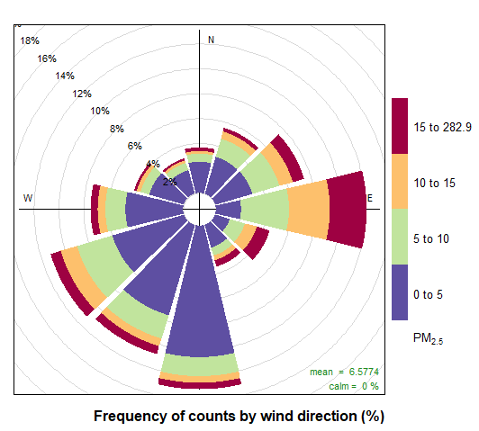

```{=html}
<!--
Copyright 2022 Province of British Columbia

Licensed under the Apache License, Version 2.0 (the "License");
you may not use this file except in compliance with the License.
You may obtain a copy of the License at

http://www.apache.org/licenses/LICENSE-2.0

Unless required by applicable law or agreed to in writing, software distributed under the License is distributed on an "AS IS" BASIS,
WITHOUT WARRANTIES OR CONDITIONS OF ANY KIND, either express or implied.
See the License for the specific language governing permissions and limitations under the License.
-->
```
<!-- Edit the README.Rmd only!!! The README.md is generated automatically from README.Rmd. -->

# bcgov/envair: BC air quality data retrieval and analysis tool

```{r, echo = FALSE}
knitr::opts_chunk$set(
  collapse = TRUE,
  comment = "#>"
)
```

# bcgovr

[](https://github.com/bcgov/repomountie/blob/master/doc/lifecycle-badges.md) [](https://opensource.org/licenses/Apache-2.0)

## Overview

bcgov/envair is an R package developed by the air quality monitoring unit of the BC Ministry of Environment and Climate Change Strategy, Knowledge Management Branch / Environmental and Climate Monitoring Section (ENV/KMB/ECMS).
It provides R-based retrieval and processing of [air quality monitoring data](https://envistaweb.env.gov.bc.ca/) from BC's provincial monitoring network.
By default the output is compatible with the widely used [openair package](https://cran.r-project.org/web/packages/openair/openair.pdf), and the data-processing functions follow the CCME Guidance Document on Achievement Determination for the Canadian Ambient Air Quality Standards (CAAQS).

## Installation

You can install `envair` directly from this GitHub repository.
To proceed, you will need the [remotes](https://cran.r-project.org/package=remotes) package:

```{r, eval=FALSE}
install.packages("remotes")
```

Next, install and load the `envair` package using `remotes::install_github()`:

```{r, eval=FALSE}
remotes::install_github("bcgov/envair")
library(envair)
```

## Features

-   Retrieve hourly data from the Air Quality Data Archive by pollutant (parameter) or by station, for any year from 1980 to yesterday.
    Retrieval can optionally flag Transboundary Flow Exceptional Events (TFEE) and merge relocated stations.
    The archive lives on ENV's FTP server: <ftp://ftp.env.gov.bc.ca/pub/outgoing/AIR/>

-   Compute averaged and rolled statistics (24-hour, rolling 8-hour, daily 1-hour and 8-hour maxima) and annual metrics, data captures, and exceedance counts, following the CCME Guidance Document on Achievement Determination and the Canadian Ambient Air Quality Standards (CAAQS).

-   Accept either a parameter name (data is fetched automatically) or an existing air quality dataframe as input to most processing functions.

-   Retrieve archived and current ventilation index data, with an option to generate a KML map.

## Functions

-   `importBC_data()` Retrieves hourly station or parameter data for the specified year/s (1980 to yesterday). If no year is given, the current year is retrieved.

    -   accepts one or more parameters (e.g. `'pm25'`, `c('no2','so2')`) or one or more station names. Station matching is case-insensitive and matches on partial text, so `'Prince George'` returns every station with that text in its name.
    -   when a station is specified, the output is a wide, openair-style table: column names are lower-cased, scalar wind speed and vector wind direction are renamed to *ws* and *wd*, and the timestamp is shifted from time-ending to time-beginning.
    -   when a parameter is specified, the output is a long table with one row per station-hour for every station that reported that pollutant.
    -   *flag_TFEE = TRUE* (the default) adds a boolean *flag_tfee* column marking days verified as Transboundary Flow Exceptional Events. This applies only to parameter queries.
    -   *merge_Stations = TRUE* combines a monitoring station with its designated alternative station (used where a station was relocated), as done in air zone reporting. This can change the reported station name.
    -   *use_openairformat = FALSE* returns the original, non-openair output and keeps the timestamp in time-ending format; *clean_names = TRUE* forces lower-case, tidyverse-friendly column names; *pad_data = TRUE* inserts rows for missing dates and fills them with `NA`.

-   `importBC_data_avg()` Retrieves pollutant (parameter) data and reduces it to the averaging or summary statistic named by *averaging_type*. It accepts a parameter name or an existing `importBC_data()` dataframe, and can process several parameters and years at once (one *averaging_type* per call).

    -   sub-annual statistics: 24-hour averages (`"24-hr"`), rolling 8-hour values (`"8-hr"`), daily 1-hour maximum (`"d1hm"`), daily 8-hour maximum (`"d8hm"`)
    -   annual summaries: pass `"annual <statistic> <averaging>"`, e.g. `"annual 98p d1hm"` (98th percentile of the daily 1-hour maxima) or `"annual mean 24-hr"` (annual mean of the daily values)
    -   values are excluded when they do not meet the *data_threshold* data-capture requirement (0.75 by default); set *data_threshold = 0* to keep all values
    -   exceedance counts: pass `"exceed <value> <averaging>"` to count how many values exceed *value*; the count is rounded to the precision of the number entered
        -   the table below lists every valid *averaging_type* value

            +-------------------------------------------+------------------------------+--------------------------------------------------------------------------+
            | Type of averaging                         | *averaging_type=* Syntax     | Output description                                                       |
            +===========================================+==============================+==========================================================================+
            | 1-hr                                      | "1-hr"                       | Outputs hourly data. No averaging done.                                  |
            +-------------------------------------------+------------------------------+--------------------------------------------------------------------------+
            | Daily Average                             | "24-hr"                      | Outputs the daily (24-hour) values.                                      |
            +-------------------------------------------+------------------------------+--------------------------------------------------------------------------+
            | Rolling 8-hour                            | "8-hr"                       | Outputs hourly values that were calculated from rolling 8-hour average.  |
            +-------------------------------------------+------------------------------+--------------------------------------------------------------------------+
            | Daily 1-hour maximum                      | "d1hm"                       | Outputs daily values of the highest 1-hour concentration                 |
            +-------------------------------------------+------------------------------+--------------------------------------------------------------------------+
            | Daily 8-hour maximum                      | "d8hm"                       | Outputs the daily 8-hour maximum for each day                            |
            +-------------------------------------------+------------------------------+--------------------------------------------------------------------------+
            | Annual mean of 1-hour values              | "annual mean 1-hr"           | Outputs the average of all hourly values                                 |
            +-------------------------------------------+------------------------------+--------------------------------------------------------------------------+
            | Annual mean of daily values               | "annual mean 24-hr"          | Outputs average of all daily values.                                     |
            |                                           |                              |                                                                          |
            |                                           | "annual mean \<avging\>"     |                                                                          |
            +-------------------------------------------+------------------------------+--------------------------------------------------------------------------+
            | Annual 98th percentile of 1-hour values   | "annual 98p 1-hr"            | Outputs the 98th percentile of the 1-hour values.                        |
            |                                           |                              |                                                                          |
            |                                           | "annual \<xxp\> \<avging\>   |                                                                          |
            +-------------------------------------------+------------------------------+--------------------------------------------------------------------------+
            | 4th Highest daily 8-hour maximum          | "annual 4th d8hm"            | Outputs the 4th highest daily 8-hour maximum.                            |
            |                                           |                              |                                                                          |
            |                                           | "annual \<rank\> \<avging\>  |                                                                          |
            +-------------------------------------------+------------------------------+--------------------------------------------------------------------------+
            | Number of daily values exceeding 28 µg/m3 | "exceed 28 24-hr"            | Outputs the number of days where the 28 µg/m3 is exceeded                |
            |                                           |                              |                                                                          |
            |                                           | "exceed \<value\> \<avging\> |                                                                          |
            +-------------------------------------------+------------------------------+--------------------------------------------------------------------------+
            | Number of exceedance to d8hm of 62ppb     | "exceed 62 d8hm"             | Outputs the number of days where the daily 8-hour maximum exceeds 62 ppb |
            |                                           |                              |                                                                          |
            |                                           | "exceed \<value\> \<avging\> |                                                                          |
            +-------------------------------------------+------------------------------+--------------------------------------------------------------------------+

            : List of possible values for the *averaging_type*.

-   `get_stats()` Calculates the year-by-year CAAQS metric values for a specified pollutant and year/s.

    -   applies to PM2.5, O3, NO2, and SO2
    -   returns a long (tidy) table with one row per station / parameter / year / CAAQS metric
    -   reports both the raw (un-rounded) statistic (*value*) and the value rounded to the CAAQS-defined precision (*value_rounded*)
    -   results are year-by-year statistics only, not the actual (multi-year) CAAQS metrics; use `get_caaqs_metrics()` for those

-   `get_caaqs_metrics()` Calculates the CAAQS (Canadian Ambient Air Quality Standards) achievement results for a specified parameter and year/s, following the Guidance Document on Achievement Determination.

    -   applies to PM2.5, O3, NO2, and SO2
    -   automatically retrieves the required data, applies TFEE flagging and station merging, checks data completeness/validity, and applies 3-year averaging where required by the CAAQS metric
    -   output includes the calculated metric value, whether the result is valid (*valid*), whether it was flagged due to an exceedance-based exception (*valid_flag*), whether it is based on only 2 of 3 years (*valid_2of3*), and the resulting management level (*mgmt_level*)

-   `get_captures()` Calculates data-capture statistics for a pollutant or an air quality dataframe. Output is a tidy table of hourly, daily, quarterly, and annual capture summaries (valid counts, total counts, and percentages).

-   `listBC_stations()` Lists the details of every air quality monitoring station, active or inactive. Pass a year to get the station list as it stood in that year.

-   `list_parameters()` Returns the vector of parameter names that `importBC_data()` can retrieve.

-   `importECCC_forecast()` Retrieves AQHI, PM2.5, PM10, O3, and NO2 forecasts from the ECCC datamart.

-   `get_venting_summary()` Summarizes the ventilation index over a date range, counting GOOD, FAIR, and POOR days.

-   `GET_VENTING_ECCC()` Retrieves the venting index bulletin (FLCN39) from the Environment and Climate Change Canada datamart or from the B.C. Open Data Portal.

-   `ventingBC_kml()` Creates a KML or shape file based on the 2019 OBSCR rules, combining the venting index with the sensitivity zones.

## Usage and Examples

#### `importBC_data()`

------------------------------------------------------------------------

##### Retrieving air quality data with TFEE flagging and merged stations

> Set *flag_TFEE = TRUE* and *merge_Stations = TRUE* to flag Transboundary Flow Exceptional Events and merge relocated stations and their instruments, matching the data preparation used in the CAAQS-reporting process.

```{r, eval=FALSE}

library(envair)
df_data <- importBC_data('pm25',years = 2015:2017, flag_TFEE = TRUE,merge_Stations = TRUE)

knitr::kable(df_data[1:4,])

```

##### Using *openair* package function on BC ENV data.

> By default, a station query returns an openair-compatible dataframe: wind columns are renamed to *ws* and *wd*, pollutant names are lower-cased (e.g. *pm25*, *no2*, *so2*), and timestamps are shifted from time-ending to time-beginning.
> Specify a station name and year/s; get station names from *listBC_stations()*.
> If no year is given, the function retrieves the latest data, which is typically unverified data from the start of the year to the current date.

```{r, eval=FALSE}
library(openair)
PG_data <- importBC_data('Prince George Plaza 400',2010:2012)
pollutionRose(PG_data,pollutant='pm25')
```

```{r,echo = FALSE}

```

##### Other features for station data retrieval

-   *use_openairformat = FALSE* keeps the original column names and the time-ending timestamp
-   wind columns come from vector wind direction and scalar wind speed
-   station names are not case sensitive and match on partial text
-   pass several stations as a vector, e.g. *c('Prince George','Kamloops')*
-   for non-consecutive years, use a vector, e.g. *c(2010,2011:2014)*
-   *pad_data = TRUE* fills gaps in the date sequence with `NA`

```{r, eval =  FALSE}
importBC_data('Prince George Plaza 400',2010:2012,use_openairformat = FALSE)
importBC_data('Kamloops',2015)
importBC_data(c('Prince George','Kamloops'),c(2010,2011:2014))
importBC_data('Trail',2015,pad_data = TRUE)
```

##### Retrieve parameter data

> Specify a parameter name to retrieve data from every station that reported it.
> These can be very large files and may use up your computer's resources.
> Use *list_parameters()* for the list of available parameters.

```{r,eval=FALSE}
pm25_3year <- importBC_data('PM25',2010:2012)
```

#### `importBC_data_avg()`

------------------------------------------------------------------------

##### Retrieving the annual average of daily values for multiple parameters

> The function processes multiple parameters and multiple years in one call, but only one *averaging_type* at a time.
> The *averaging_type* can be a simple average (e.g. 24-hour or 8-hour) or an annual summary (e.g. `annual 98p d1hm`, `annual mean 24-hr`).
> See the table above for the full list of *averaging_type* values.
>
> ```{r, eval = FALSE}
> #using a parameter name as input, the data is fetched automatically
> annual_mean <- importBC_data_avg(c('pm25','o3'), years = 2015:2018, averaging_type = 'annual mean 24-hr')
> >
> #or pass a dataframe you already retrieved
> df_input <- importBC_data(c('pm25','o3'), years = 2015:2018)
> annual_mean <- importBC_data_avg(df_input, averaging_type = 'annual mean 24-hr')
> ```

#### `get_stats()`

------------------------------------------------------------------------

##### Calculate the year-by-year CAAQS metric values

> The function calculates the CAAQS metric value (e.g. annual mean, 98th percentile, 4th-highest daily 8-hour maximum) for each station, parameter, and year.
> It performs a year-by-year calculation only, so the results are not the actual (multi-year) CAAQS metrics, but can be used to derive them.
> Use `get_caaqs_metrics()` for the actual CAAQS achievement results.
> Output is a long (tidy) table with both the raw statistic (*value*) and the value rounded to the CAAQS-defined precision (*value_rounded*).
>
> ```{r, eval = FALSE}
> #example retrieves the year-by-year CAAQS metric values
> stats_result <- get_stats(param = 'o3', years = 2016, add_TFEE = TRUE, merge_stations = TRUE)
> >
> ```

#### `get_caaqs_metrics()`

------------------------------------------------------------------------

##### Calculate the CAAQS achievement results

> The function retrieves the required data (applying TFEE flagging and station merging), checks data completeness and validity, applies 3-year averaging where the CAAQS metric requires it, and determines the resulting management level for the specified parameter and year/s.
> Unlike *get_stats()*, the results reflect the actual CAAQS metric (e.g. 3-year averages), not just year-by-year statistics.
> The output also reports whether the result is valid (*valid*), whether it was flagged for an exceedance-based exception (*valid_flag*), and whether it rests on only 2 of 3 years (*valid_2of3*).
>
> ```{r, eval = FALSE}
> #example retrieves the CAAQS achievement results
> caaqs_result <- get_caaqs_metrics("pm25", years = 2017:2020)
> >
> ```

#### `get_captures()`

------------------------------------------------------------------------

##### Summarize data captures

> The function summarizes data captures (valid counts, total counts, and percentages) by hour, day, quarter, and year.
> The input can be a parameter name (data is fetched automatically) or an air quality dataframe from *importBC_data()*.
>
> ```{r, eval = FALSE}
> #using a parameter name as input
> data_captures <- get_captures(parameter = c('pm25','o3'), years = 2015:2018, merge_Stations = TRUE)
> >
> #or using a dataframe you already retrieved
> air_data <- importBC_data(c('pm25','o3'), years = 2015:2018, merge_Stations = TRUE)
> data_captures <- get_captures(parameter = air_data, years = 2015:2018)
> ```

#### `listBC_stations()`

------------------------------------------------------------------------

> Returns a dataframe of details for every air quality monitoring station.
> Pass a year to get the station details as they stood in that year.
> Historical entries may be incomplete, as no system has been in place to track these details over time.

```{r, eval = FALSE}
listBC_stations()
listBC_stations(2016)
```

```{r, echo = FALSE,results='hide',message=FALSE,warning=FALSE}
table_ <- envair::listBC_stations()

```

```{r, echo= FALSE}
knitr::kable(table_[1:4,])
```

#### `list_parameters()`

------------------------------------------------------------------------

> Returns a character vector of the parameters that *importBC_data()* can retrieve.

#### `GET_VENTING_ECCC()`

------------------------------------------------------------------------

> Returns a dataframe of the venting index. With no argument it retrieves the most recent bulletin; pass a date or a vector of dates to retrieve those days.

```{r, eval = FALSE}
GET_VENTING_ECCC()
GET_VENTING_ECCC('2019-11-08')
GET_VENTING_ECCC((dates = seq(from = lubridate::ymd('2021-01-01'),
        to = lubridate::ymd('2021-05-01'), by = 'day')))
```

```{r, echo = FALSE,results='hide',message=FALSE,warning=FALSE}
table_ <- envair::GET_VENTING_ECCC()

```

```{r, echo = FALSE}
knitr::kable(table_[1:4,])
```

#### `importECCC_forecast()`

------------------------------------------------------------------------

-   Retrieves forecast and model data from the ECCC datamart
-   available parameters: AQHI, PM25, PM10, NO2, O3

```{r, eval = FALSE}
importECCC_forecast('no2')
```

#### `ventingBC_kml()`

------------------------------------------------------------------------

-   creates a KML object based on the 2019 OBSCR rules
-   pass an output directory to save the file there as *Venting_Index_HD.kml*

```{r, eval = FALSE}
ventingBC_kml()
ventingBC_kml('C:/temp/')
```
